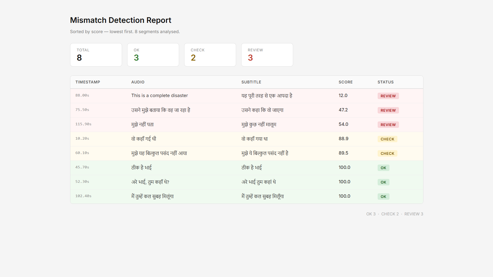

# Burn-in Subtitle Checker (Mismatch Detection)

A Python-based utility to detect and flag mismatches between audio transcriptions and burnt-in subtitle text. This tool is designed to automate quality control for video content, ensuring that what is spoken matches what is displayed on screen.

---

## Scope (Demo PR)

This implementation focuses on **Module 3: Mismatch Detection & Report Generation** from the pipeline.
Audio transcription and subtitle extraction are simulated using structured input (`data.json`) to focus specifically on comparison logic and reporting.

---

## Preview



---

## Features

* **Text Normalization:** Automatically strips punctuation, normalizes casing, and removes redundant spaces to ensure fair comparisons.
* **Hybrid Scoring Engine:** Combines `fuzz.ratio` (for exact sequence matching) and `fuzz.token_sort_ratio` (for word-order independence) to handle noisy, real-world data gracefully.
* **Automated Grading:** Classifies matches into `OK` (≥90%), `CHECK` (70%–89%), and `REVIEW` (<70%) based on similarity thresholds.
* **Clean HTML Reporting:** Generates a lightweight, human-readable, and sortable HTML dashboard (`report.html`) summarizing the findings.

---

## Tech Stack

* **Python 3.x**
* **RapidFuzz:** High-performance string matching library.
* **HTML/CSS:** For generating the static summary report.

---

## How it Works

1. **Input Simulation:** The script ingests a list of segments containing timestamps, transcribed audio text, and OCR-extracted subtitle text.
2. **Comparison:** The `comparator.py` module cleans both text inputs and calculates a combined fuzzy similarity score.
3. **Reporting:** The `report.py` module takes the graded data, sorts it to show the worst mismatches first, and compiles a clean, structured HTML report highlighting problematic segments.

---

## Getting Started

### Prerequisites

Ensure you have Python 3 installed. Install the required dependencies:

```bash
pip install -r requirements.txt
```

---

## Quick Run

Execute the main script to process the sample data and generate the report:

```bash
python main.py
```

Upon completion, open `report.html` in any web browser to view the results.

---

## Sample Input / Output

* **`data.json`**: A simulated array of dictionaries representing extracted segments. Each entry includes a `timestamp`, `audio` string, and `subtitle` string.
* **`report.html`**: The final output. A clean table sorting all segments by lowest score first, color-coding them based on their review status.

---

## Limitations

* **Simulated Input:** For the scope of this demo, input text is simulated via `data.json`. This project does not currently integrate active Automatic Speech Recognition (ASR) like Whisper or Optical Character Recognition (OCR).
* **Basic Similarity:** The matching relies on character and token-based string similarity. It does not understand semantic similarity (e.g., "Yeah" vs. "Yes").

---

## Future Improvements

* **ASR & OCR Integration:** Directly process video/audio files by integrating tools like OpenAI Whisper (for audio) and Tesseract or EasyOCR (for subtitles).
* **Semantic Matching:** Integrate NLP models (like Sentence Transformers) to calculate semantic similarity, reducing false positives where meaning is preserved despite different wording.
* **Time Alignment:** Implement intelligent sliding-window comparisons to handle slight synchronization drift between audio and subtitles.
